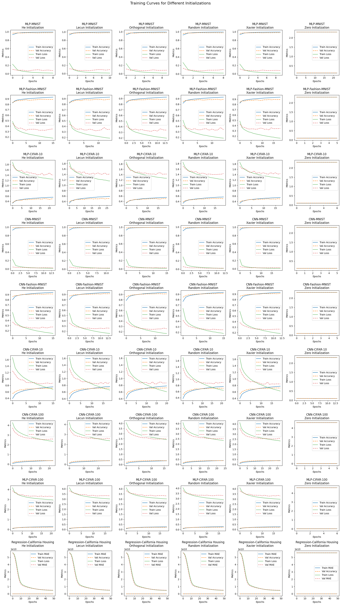

# DL Assignment 1 Case Study - weight Initialization Techniques

Submitted by:

|   | Name | Roll No. |
|---|---|---|
| 1 | C. Rithesh Reddy | 160122771034 |
| 2 | G. Jayanth       | 160122771041 |
| 3 | J. Pavan Kumar   | 160122771045 |

**Section**: AI&DS 1 (I1) ; SEM VI

## Introduction
Problem Statement: Weight Initialization

In deep learning, weight initialization significantly impacts the training process. If weights are not properly initialized, it can lead to:

-	Vanishing Gradients: When weights are too small, gradients shrink exponentially during backpropagation, making it difficult for deeper layers to learn.
-	Exploding Gradients: When weights are too large, gradients grow uncontrollably, causing instability in training.
-	Slow Convergence: Poor initialization results in inefficient updates, requiring more iterations to reach an optimal solution.
-	Suboptimal Performance: Improper initialization may prevent the model from learning meaningful patterns, reducing overall accuracy.

## Experimentation
The code used to perform experimentation can be found in this repository.
Various Initialization techniques like 
were tested on different DL models and tasks.

## Findings table 
Complete results table can be found in the [results.csv](./results.csv) file. 

## Conclusion
Weight initialization techniques significantly impact the stability and efficiency of deep learning models by influencing gradient flow,
training stability, and convergence speed. Random Initialization assigns arbitrary small values to weights, often causing vanishing or exploding gradients, 
leading to unstable training and slow convergence. Xavier (Glorot) Initialization balances weight variance by considering both input and output neurons, 
preventing gradient issues and improving stability, especially for sigmoid and tanh activations. However, it struggles with ReLU activations, 
which tend to zero out negative values. He (Kaiming) Initialization is optimized for ReLU and Leaky ReLU, adjusting variance to maintain proper gradient flow, 
preventing dying neurons, and accelerating convergence in deep networks. 
Overall, selecting the right initialization technique is crucial for ensuring smooth optimization and faster training in neural networks.

## Results (Plot)

